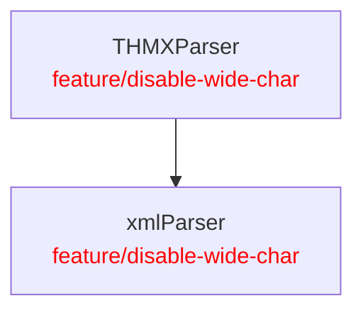

```mermaid
graph TD
    %% Package definitions
    xmlParser[xmlParser<br/><font color='red'>feature/disable-wide-char</font>]
    THMXParser[THMXParser<br/><font color='red'>feature/disable-wide-char</font>]

    %% Package relations
    THMXParser --> xmlParser
```
